# VAEGAN
Implementation of [Autoencoding beyond pixels using a learned similarity metric](https://arxiv.org/abs/1512.09300v2) in Keras.

## Prerequisites

- tensorflow >=1.4
- keras >= 2.1.4
- OpenCV >= 3.4.0
- numpy

## Dataset

[CelebA dataset](http://mmlab.ie.cuhk.edu.hk/projects/CelebA.html)

- 202599 celebrity images

## VAE model

## VAE results

VAE generation from noise:

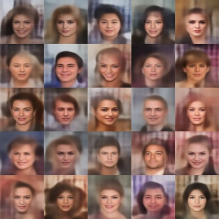

VAE autoencoder input:

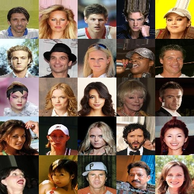

VAE autoencoder reconstruction:

## GAN model

## GAN results

GAN generation from noise:

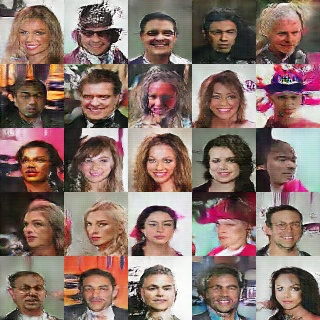

## VAEGAN model

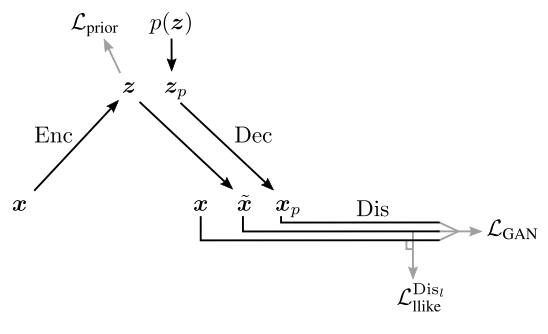

VAEGAN encoder model:

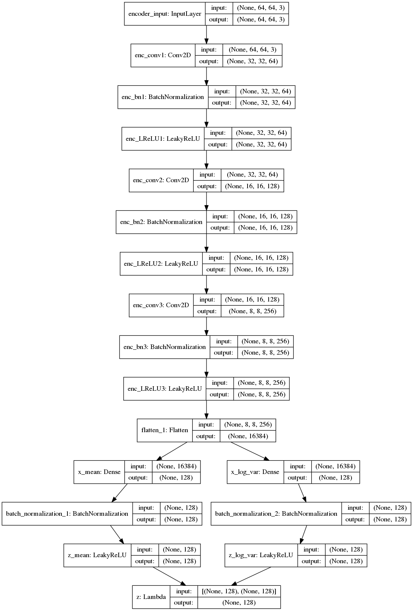

VAEGAN decoder model:

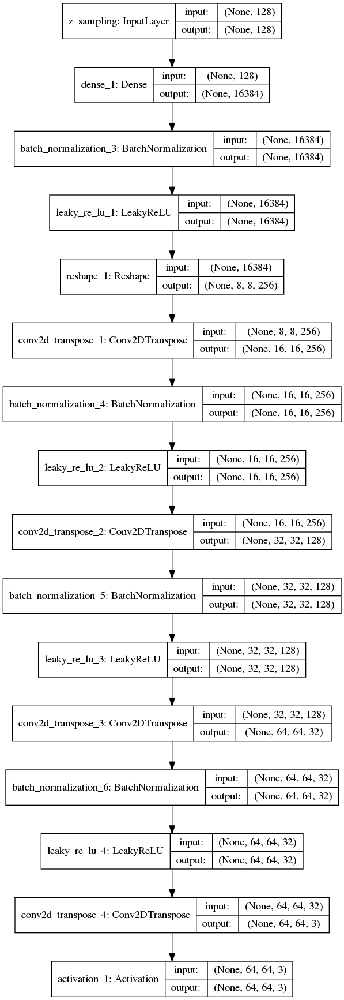

VAEGAN discriminator model:

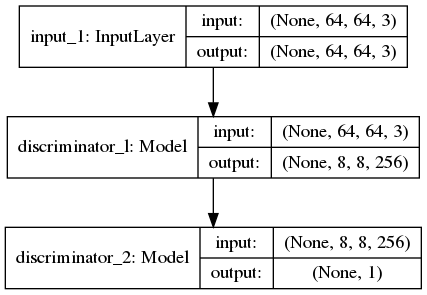

VAEGAN encoder model for training:

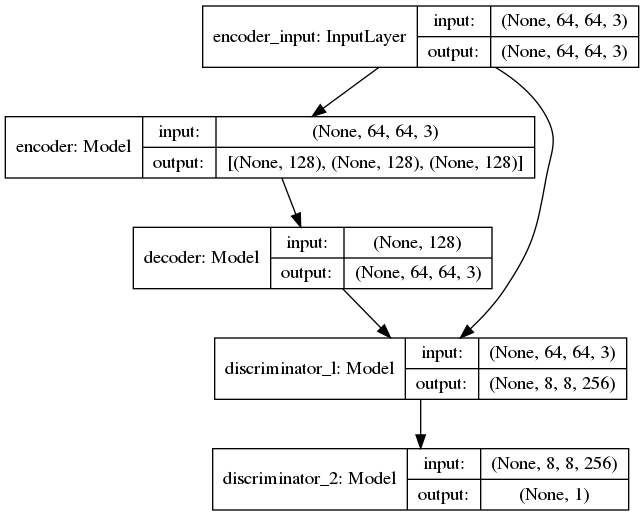

VAEGAN decoder model for training:

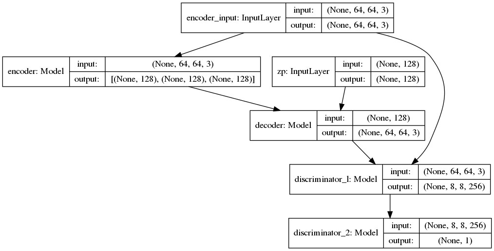

## VAEGAN results

VAEGAN generation from noise:

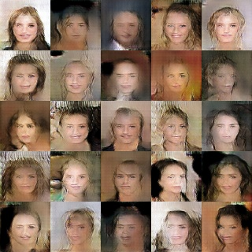

VAEGAN autoencoder input:

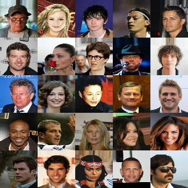

VAEGAN autoencoder reconstruction:

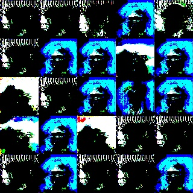

## VAEGAN results with Checkerboard Artifacts

VAEGAN generation from noise:

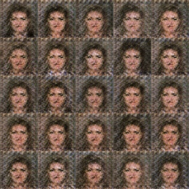

VAEGAN autoencoder input:

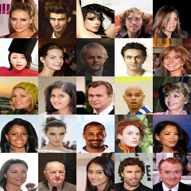

VAEGAN autoencoder reconstruction:

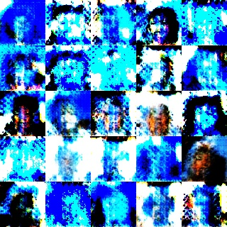

## Problems Encountered

- Hard to train.
- Numerical instability in loss.
