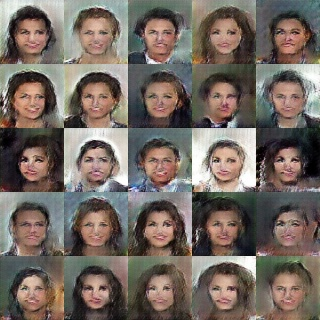
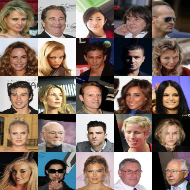
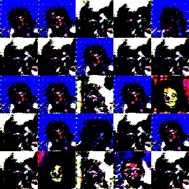

# VAEGAN
Implementation of [Autoencoding beyond pixels using a learned similarity metric](https://arxiv.org/abs/1512.09300v2) in Keras.

EE298 Group 4;

Peralta, Daryl
Mendaros, Jonathan
Aslan, Cha-dash

## Prerequisites

- tensorflow >=1.4
- keras >= 2.1.4
- OpenCV >= 3.4.0
- numpy

Usage

For training:

python train.py --dataset [path to dataset]

Ex.

python train.py --dataset /home/daryl/datasets/img_align_celeba

For testing:

python test.py --dataset_path [path dataset] --encoder_path [path to encoder] --decoder_path [path to decoder]

Ex.

python test.py --dataset_path '/home/daryl/datasets/img_align_celeba' --encoder_path checkpoints/encoder_chk-vaegan_complete_demo.hdf5 --decoder_path checkpoints/decoder_chk-vaegan_complete_demo.hdf5 --dataset_path /home/daryl/datasets/img_align_celeba

Checkpoints can be found [here](https://drive.google.com/drive/folders/1hoU9QXccq6M1OkmtJbetyi5UoC9apgkU?usp=sharing).

## Dataset

[CelebA dataset](http://mmlab.ie.cuhk.edu.hk/projects/CelebA.html)

- 202599 celebrity images

## VAEGAN model

VAEGAN encoder model:

VAEGAN decoder model:

VAEGAN discriminator model:

VAEGAN encoder model for training (only the encoder is trainable):

VAEGAN decoder model for training (only the decoder is trainable):

## VAE results

VAE generation from noise:

VAE autoencoder input:

VAE autoencoder reconstruction:

## GAN results

GAN generation from noise:

## VAEGAN results

VAEGAN generation from noise:

VAEGAN autoencoder input:

VAEGAN autoencoder reconstruction:

VAEGAN generation from noise:

VAEGAN autoencoder input:

VAEGAN autoencoder reconstruction:

## VAEGAN results with Checkerboard Artifacts

VAEGAN generation from noise:

VAEGAN autoencoder input:

VAEGAN autoencoder reconstruction:

